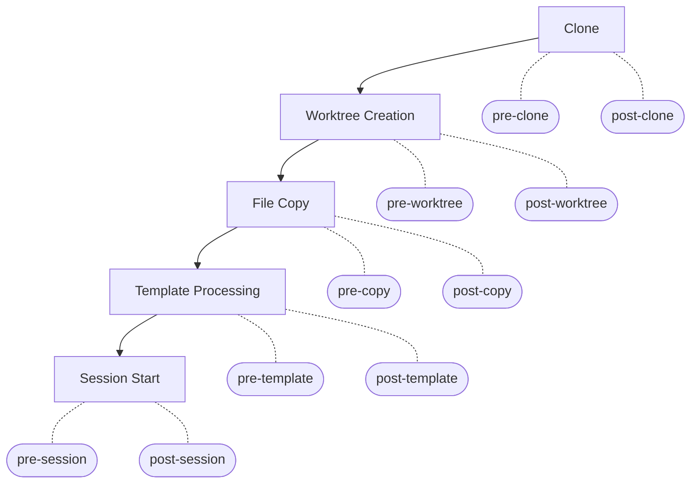

# Hooks Lifecycle

codeherd supports hook lifecycle management for project workflows. Users configure setup scripts for each step of the project lifecycle via per-project configuration in `config.toml`. Each lifecycle step triggers pre and post hooks. A non-zero exit code from any hook stops the chain.

## Lifecycle



## Configuration

Hooks and files are configured per-project in `config.toml`:

```toml
[projects.myapp]
repo = "git@github.com:user/myapp.git"
default_branch = "main"

# Files to copy into new worktrees
files = [
  "CLAUDE.md",                                       # same path in worktree
  ".cursorrules",                                     # same path in worktree
  "~/.config/codeherd/prompts/safety.md:RULES.md",   # custom destination
]

[projects.myapp.hooks]
pre-clone = "echo preparing"
post-clone = "make deps"
pre-worktree = "echo creating worktree"
post-worktree = "npm install"
pre-copy = "echo copying files"
post-copy = "chmod 600 .env"
pre-template = "vault read secret/myapp > .secrets"
post-template = "echo templates rendered"
pre-session = "docker compose up -d"
post-session = "curl -X POST https://hooks.example.com/started"
```

Each hook accepts a single shell command. Omit a hook to skip it.

## File Copy

The `files` list copies files into new worktrees during the copy step.

| Entry format | Source | Destination |
|---|---|---|
| `"CLAUDE.md"` | Clone dir / `CLAUDE.md` | Worktree / `CLAUDE.md` |
| `"src/config.json"` | Clone dir / `src/config.json` | Worktree / `src/config.json` |
| `"~/.config/prompts/safety.md:RULES.md"` | `~/.config/prompts/safety.md` | Worktree / `RULES.md` |
| `"/absolute/path/file.txt:subdir/file.txt"` | `/absolute/path/file.txt` | Worktree / `subdir/file.txt` |

Relative paths resolve from the clone directory. Absolute paths and `~/` paths copy from the filesystem. Intermediate directories are created as needed.

## Template Processing

After files are copied, codeherd scans the worktree for files ending with `.herd` and renders them using Go's `text/template` engine. The output is written as a sibling file without the `.herd` suffix:

- `.env.herd` -> `.env`
- `docker-compose.yml.herd` -> `docker-compose.yml`

### Template Functions

| Function | Description | Example |
|---|---|---|
| `port "name"` | Deterministic port (10000-59999) from project + branch + name | `{{ port "http" }}` |
| `env "VAR" "default"` | Read environment variable with fallback | `{{ env "API_KEY" "dev-key" }}` |

### Template Context

| Field | Description |
|---|---|
| `.Project` | Project name |
| `.Branch` | Branch name |
| `.WorktreePath` | Worktree directory path |
| `.SessionName` | Session name |

## Environment Variables

Hooks receive context as environment variables. Each step provides the variables relevant to it.

### Clone hooks (`pre-clone`, `post-clone`)

| Variable | Description |
|---|---|
| `CODEHERD_PROJECT` | Project name |
| `CODEHERD_REPO` | Repository URL |
| `CODEHERD_CLONE_DIR` | Clone directory path |

### Worktree hooks (`pre-worktree`, `post-worktree`)

| Variable | Description |
|---|---|
| `CODEHERD_PROJECT` | Project name |
| `CODEHERD_BRANCH` | Branch name |
| `CODEHERD_REPO` | Repository URL |
| `CODEHERD_CLONE_DIR` | Clone directory path |
| `CODEHERD_WORKTREE_PATH` | Worktree directory path |

### Copy hooks (`pre-copy`, `post-copy`)

| Variable | Description |
|---|---|
| `CODEHERD_PROJECT` | Project name |
| `CODEHERD_BRANCH` | Branch name |
| `CODEHERD_CLONE_DIR` | Clone directory path |
| `CODEHERD_WORKTREE_PATH` | Worktree directory path |

### Template hooks (`pre-template`, `post-template`)

| Variable | Description |
|---|---|
| `CODEHERD_PROJECT` | Project name |
| `CODEHERD_BRANCH` | Branch name |
| `CODEHERD_WORKTREE_PATH` | Worktree directory path |
| `CODEHERD_SESSION_NAME` | Session name |

### Session hooks (`pre-session`, `post-session`)

| Variable | Description |
|---|---|
| `CODEHERD_PROJECT` | Project name |
| `CODEHERD_BRANCH` | Branch name |
| `CODEHERD_WORKTREE_PATH` | Worktree directory path |
| `CODEHERD_SESSION_NAME` | Session name |

## Error Handling

- A non-zero exit code from any hook stops the workflow
- Error output includes: hook name, command, exit code, and stderr
- No automatic rollback -- if a post-hook fails, prior steps remain applied
- Unconfigured hooks are silently skipped

## Working Directory

Hook commands run with their working directory set to the relevant context:

- **Clone hooks**: `projects_dir` (worktree does not exist yet)
- **All other hooks**: worktree path

Relative paths in hook commands resolve from this working directory.
