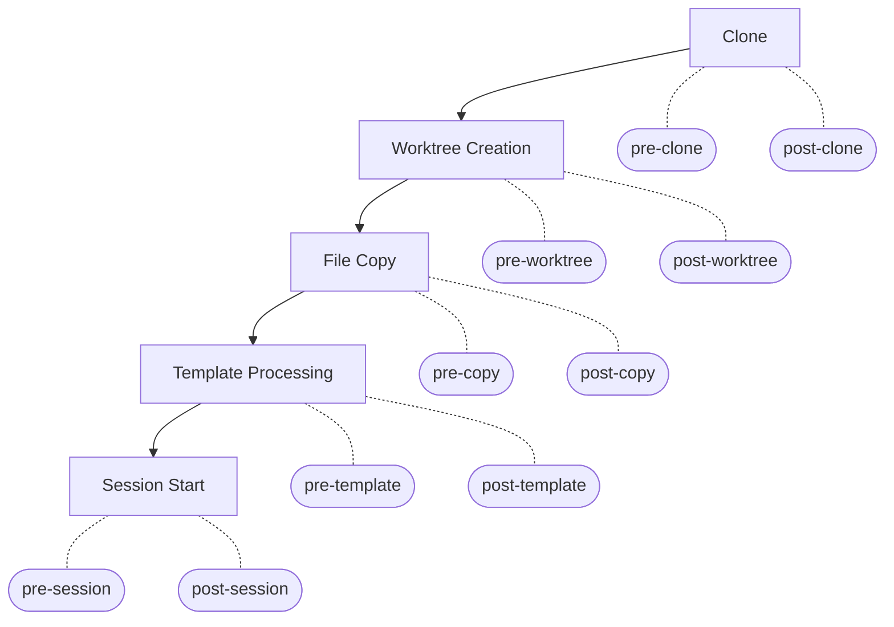

# Hooks Lifecycle Design

## Overview

Add hook lifecycle management to codeherd. Users plug setup scripts into each step of the project workflow via per-project configuration in `config.toml`. Each lifecycle step triggers pre and post hooks. A non-zero exit code stops the chain.

This feature also introduces two new workflow steps: **file copy** and **template processing**.

## Lifecycle



Each step triggers a **pre** and **post** hook. A non-zero exit code from any hook stops the chain.

## Config Schema

Hooks are configured per-project in `config.toml`:

```toml
[projects.myapp]
repo = "git@github.com:user/myapp.git"
default_branch = "main"

# Files to copy into new worktrees
files = [
  "CLAUDE.md",                                       # same path in worktree
  ".cursorrules",                                     # same path in worktree
  "~/.config/codeherd/prompts/safety.md:RULES.md",   # custom destination
]

[projects.myapp.hooks]
pre-clone = "echo preparing"
post-clone = "make deps"
pre-worktree = "echo creating worktree"
post-worktree = "npm install"
pre-copy = "echo copying files"
post-copy = "chmod 600 .env"
pre-template = "vault read secret/myapp > .secrets"
post-template = "echo templates rendered"
pre-session = "docker compose up -d"
post-session = "curl -X POST https://hooks.example.com/started"
```

Each hook accepts a single shell command. Omit a hook to skip it.

### Go structs

```go
// internal/config
type ProjectConfig struct {
    Repo          string      `toml:"repo"`
    DefaultBranch string      `toml:"default_branch"`
    EnvTemplate   string      `toml:"env_template"`
    Files         []string    `toml:"files"`
    Hooks         HooksConfig `toml:"hooks"`
}

type HooksConfig struct {
    PreClone     string `toml:"pre-clone"`
    PostClone    string `toml:"post-clone"`
    PreWorktree  string `toml:"pre-worktree"`
    PostWorktree string `toml:"post-worktree"`
    PreCopy      string `toml:"pre-copy"`
    PostCopy     string `toml:"post-copy"`
    PreTemplate  string `toml:"pre-template"`
    PostTemplate string `toml:"post-template"`
    PreSession   string `toml:"pre-session"`
    PostSession  string `toml:"post-session"`
}
```

## Package Design

### `internal/semconv` — Constants

Hook name constants and attribute constants for environment variables:

```go
// Hook names
const (
    HookPreClone     = "pre-clone"
    HookPostClone    = "post-clone"
    HookPreWorktree  = "pre-worktree"
    HookPostWorktree = "post-worktree"
    HookPreCopy      = "pre-copy"
    HookPostCopy     = "post-copy"
    HookPreTemplate  = "pre-template"
    HookPostTemplate = "post-template"
    HookPreSession   = "pre-session"
    HookPostSession  = "post-session"
)

// Hook attributes — used as environment variable names
const (
    HookAttrProject      = "CODEHERD_PROJECT"
    HookAttrBranch       = "CODEHERD_BRANCH"
    HookAttrRepo         = "CODEHERD_REPO"
    HookAttrCloneDir     = "CODEHERD_CLONE_DIR"
    HookAttrWorktreePath = "CODEHERD_WORKTREE_PATH"
    HookAttrSessionName  = "CODEHERD_SESSION_NAME"
)
```

### `internal/hooks` — Hook Interface

```go
type Hook interface {
    Trigger(name string, args map[string]string) error
}
```

Implementation:
- Receives `config.HooksConfig` at construction
- Maps hook name to configured command string
- If command is empty, returns nil (no-op)
- Executes command via `sh -c` with the args map set as environment variables
- Returns error on non-zero exit code (includes hook name, command, exit code, stderr)

A no-op implementation is provided for tests and for when no hooks are configured.

The hooks package does no transformation on the args map — services pass `HookAttr*` constants as keys directly.

### `internal/filecopy` — File Copy Service

```go
type Service struct {
    hook hooks.Hook
}

func New(hook hooks.Hook) *Service

// Copy processes the files list from config.
// baseDir is the clone directory (for relative source paths).
// targetDir is the worktree path (for relative destination paths).
func (s *Service) Copy(files []string, baseDir, targetDir string) error
```

Parsing rules for each entry in `files`:
- `"CLAUDE.md"` — source: `baseDir/CLAUDE.md`, dest: `targetDir/CLAUDE.md`
- `"src/config.json"` — source: `baseDir/src/config.json`, dest: `targetDir/src/config.json`
- `"~/.config/prompts/safety.md:RULES.md"` — source expanded, dest: `targetDir/RULES.md`
- `"/absolute/path/file.txt:subdir/file.txt"` — source as-is, dest: `targetDir/subdir/file.txt`

Creates intermediate directories as needed. Returns error if source file does not exist.

Triggers `pre-copy` and `post-copy` hooks internally.

### `internal/herdtemplate` — Template Processing Service

Refactored from `internal/envtemplate`. Scans for `.herd` suffix instead of hardcoded `.env.template`.

```go
type Service struct {
    hook hooks.Hook
}

func New(hook hooks.Hook) *Service

func (s *Service) Process(ctx ProcessContext) error
```

Behavior:
1. Walk the worktree directory
2. Find all files ending with `.herd`
3. Render each using Go `text/template` with existing functions (`port`, `env`)
4. Write output as sibling file without `.herd` suffix (e.g., `.env.herd` → `.env`)

Template context: `.Project`, `.Branch`, `.WorktreePath`, `.SessionName`.

Triggers `pre-template` and `post-template` hooks internally.

### Service Integration

Each service receives `hooks.Hook` as a dependency:

```go
// internal/project
type Service struct {
    cfg  map[string]config.ProjectConfig
    git  GitRunner
    hook hooks.Hook
}

// internal/worktree
type Service struct {
    cfg  map[string]config.ProjectConfig
    wt   WorktreeRunner
    hook hooks.Hook
}

// internal/session
type Service struct {
    tmux *tmux.Client
    hook hooks.Hook
}
```

Services trigger their own hooks internally. The `cmd/` layer and `internal/tui` orchestrate the chain:

```go
// cmd/ orchestration (e.g., session start, worktree new)
projectSvc.Clone(...)       // triggers pre-clone, clone, post-clone
worktreeSvc.New(...)        // triggers pre-worktree, create, post-worktree
filecopySvc.Copy(...)       // triggers pre-copy, copy files, post-copy
templateSvc.Process(...)    // triggers pre-template, render .herd files, post-template
sessionSvc.Start(...)       // triggers pre-session, start, post-session
```

Any error stops the chain. No automatic rollback.

### Orchestration Points

The lifecycle chain runs from two places:

- **`cmd/`** — command handlers (`session start`, `worktree new`) orchestrate the relevant subset of the chain
- **`internal/tui`** — the TUI dashboard triggers the same chain when users create worktrees or start sessions interactively

Both must use the same services with hooks injected, ensuring consistent behavior regardless of entry point.

## File Copy

The `files` list copies files into new worktrees during the copy step.

| Entry format | Source | Destination |
|---|---|---|
| `"CLAUDE.md"` | Clone dir / `CLAUDE.md` | Worktree / `CLAUDE.md` |
| `"src/config.json"` | Clone dir / `src/config.json` | Worktree / `src/config.json` |
| `"~/.config/prompts/safety.md:RULES.md"` | `~/.config/prompts/safety.md` | Worktree / `RULES.md` |
| `"/absolute/path/file.txt:subdir/file.txt"` | `/absolute/path/file.txt` | Worktree / `subdir/file.txt` |

Relative paths resolve from the clone directory. Absolute paths and `~/` paths copy from the filesystem.

## Template Processing

After files are copied, codeherd scans the worktree for files ending with `.herd` and renders them using Go's `text/template` engine. The output is written as a sibling file without the `.herd` suffix:

- `.env.herd` → `.env`
- `docker-compose.yml.herd` → `docker-compose.yml`

Available template functions:

| Function | Description | Example |
|---|---|---|
| `port "name"` | Deterministic port (10000–59999) from project + branch + name | `{{ port "http" }}` |
| `env "VAR" "default"` | Read environment variable with fallback | `{{ env "API_KEY" "dev-key" }}` |

Template context fields: `.Project`, `.Branch`, `.WorktreePath`, `.SessionName`.

## Environment Variables

Hooks receive context as environment variables. Each step provides the variables relevant to it.

### Clone hooks (`pre-clone`, `post-clone`)

| Variable | Description |
|---|---|
| `CODEHERD_PROJECT` | Project name |
| `CODEHERD_REPO` | Repository URL |
| `CODEHERD_CLONE_DIR` | Clone directory path |

Working directory: `projects_dir`

### Worktree hooks (`pre-worktree`, `post-worktree`)

| Variable | Description |
|---|---|
| `CODEHERD_PROJECT` | Project name |
| `CODEHERD_BRANCH` | Branch name |
| `CODEHERD_REPO` | Repository URL |
| `CODEHERD_CLONE_DIR` | Clone directory path |
| `CODEHERD_WORKTREE_PATH` | Worktree directory path |

Working directory: worktree path

### Copy hooks (`pre-copy`, `post-copy`)

| Variable | Description |
|---|---|
| `CODEHERD_PROJECT` | Project name |
| `CODEHERD_BRANCH` | Branch name |
| `CODEHERD_CLONE_DIR` | Clone directory path |
| `CODEHERD_WORKTREE_PATH` | Worktree directory path |

Working directory: worktree path

### Template hooks (`pre-template`, `post-template`)

| Variable | Description |
|---|---|
| `CODEHERD_PROJECT` | Project name |
| `CODEHERD_BRANCH` | Branch name |
| `CODEHERD_WORKTREE_PATH` | Worktree directory path |
| `CODEHERD_SESSION_NAME` | Session name |

Working directory: worktree path

### Session hooks (`pre-session`, `post-session`)

| Variable | Description |
|---|---|
| `CODEHERD_PROJECT` | Project name |
| `CODEHERD_BRANCH` | Branch name |
| `CODEHERD_WORKTREE_PATH` | Worktree directory path |
| `CODEHERD_SESSION_NAME` | Session name |

Working directory: worktree path

## Error Handling

- A non-zero exit code from any hook stops the workflow
- Error output includes: hook name, command, exit code, and stderr
- No automatic rollback — if a post-hook fails, prior steps remain applied
- Unconfigured hooks are silently skipped

## Hook Command Working Directory

Hook commands run with their working directory set to the relevant context:
- **Clone hooks**: `projects_dir` (worktree does not exist yet)
- **All other hooks**: worktree path

Relative paths in hook commands resolve from this working directory.

## Future Considerations

- `.codeherd/hooks/` convention in the project repo (repo-level hooks)
- `ch setup` one-command bootstrapping that runs the full lifecycle chain
